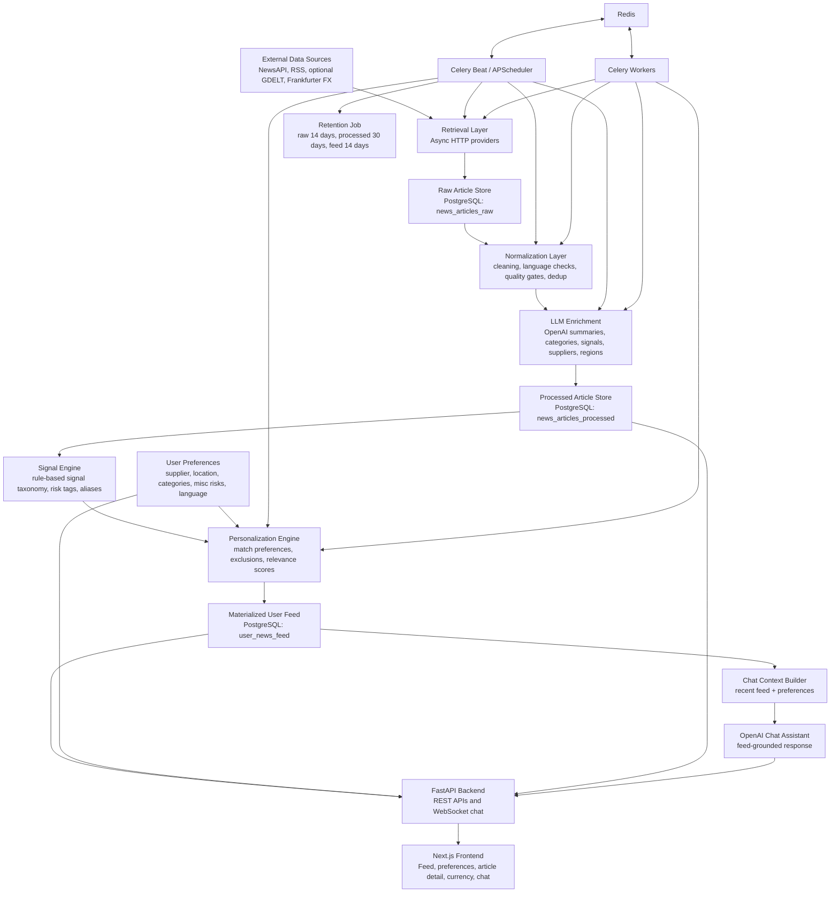

# ProcureSignal Interview Preparation

This document explains ProcureSignal in a simple but professional way. It is written for
mid-senior and senior Data Engineering / AI Engineering interviews, where the interviewer
expects both business understanding and engineering depth.

## 1. What Is The Functioning Of The Web Application?

ProcureSignal is an AI-powered procurement intelligence application. It collects business,
supplier, logistics, regulatory, currency, and market news from multiple sources, cleans and
enriches that data, classifies it into procurement-relevant signals, stores it in a database,
and shows each user a personalized feed based on their company preferences.

Users can:

- Sign in with a company email.
- Save preferences for suppliers, locations, categories, and miscellaneous risk signals.
- See a personalized procurement news feed.
- Search and open detailed article views.
- Use a feed-grounded chat assistant to ask questions about recent market signals.
- Monitor EUR currency movement against supplier-market currencies for procurement timing.
- Change platform language.

The important idea is that the application turns unstructured news into structured,
ranked, procurement-specific intelligence.

### End-To-End Architecture Diagram

### Functional Flow In Simple Steps

1. Data is collected from news APIs, RSS feeds, and currency APIs.
2. Raw data is stored in PostgreSQL with an ingest hash to avoid duplicates.
3. Articles are normalized and filtered for basic quality.
4. OpenAI enriches articles with summaries, categories, supplier names, regions, and risk tags.
5. Rule-based and taxonomy-based logic identifies procurement signals such as tariffs, strikes,
   M&A, supply disruption, sanctions, bankruptcy, and regional risk.
6. User preferences are stored in PostgreSQL.
7. The personalization engine compares each article against user preferences and exclusions.
8. A user-specific feed is materialized in the database for fast loading.
9. The frontend calls FastAPI endpoints to show the feed, details, preferences, chat, and currency monitor.
10. The chat assistant builds a small context from the user's latest feed and preferences before calling OpenAI.
11. Scheduled jobs keep data fresh and retention jobs delete stale data.

## 2. What Business Problem Is This Solving And What Business Value Does It Create?

### Business Problem

Procurement teams are exposed to fast-changing external risks:

- Supplier bankruptcy or financial weakness.
- Strikes and labor disruptions.
- Tariffs, sanctions, and trade restrictions.
- Regional conflict or logistics disruption.
- Commodity and currency movement.
- Regulation changes.
- Supplier concentration in risky regions.

In many companies, buyers still track these risks manually through news websites, email alerts,
spreadsheets, and supplier updates. That creates three major problems:

- Information overload: too much generic news and not enough relevant signals.
- Late detection: teams often find out after the risk has already affected cost or supply.
- Poor personalization: every buyer, category manager, and company has different suppliers,
  locations, and risks, but generic news feeds do not know that context.

### Business Value

ProcureSignal creates value by making procurement risk monitoring proactive and personalized.

| Value Area | How ProcureSignal Helps |
|---|---|
| Faster risk detection | Scheduled ingestion and enrichment surface signals before manual review would. |
| Reduced manual effort | Buyers do not need to scan many news sources every morning. |
| Better decision-making | Signals are ranked by supplier, location, category, and risk relevance. |
| Cost awareness | EUR currency monitor helps procurement teams think about timing large purchases. |
| Operational resilience | Early warning on disruptions gives teams time to switch suppliers, increase inventory, or renegotiate. |
| Knowledge continuity | Chat history, preferences, and materialized feeds preserve context by user. |
| Personalization | Each user sees intelligence based on their own company focus. |
| Executive visibility | Structured signals can become dashboards, alerts, and reports. |

In interview language:

> ProcureSignal reduces the gap between external market events and procurement action. It converts unstructured news into personalized, structured, explainable procurement intelligence.

## 3. What Tech Stack Has Been Used?

### Frontend

- Next.js 14
- React
- TypeScript
- Tailwind CSS
- Zustand for lightweight client state
- Axios for API calls
- Vitest and Testing Library for frontend tests

### Backend

- Python 3.11
- FastAPI
- Pydantic
- SQLAlchemy async ORM
- asyncpg PostgreSQL driver
- Alembic migrations
- Uvicorn ASGI server

### Data And Orchestration

- PostgreSQL for persistent storage
- Redis as Celery broker/result backend
- Celery workers and Celery beat for background jobs
- APScheduler as an optional API-owned scheduler
- Docker Compose for local full-stack orchestration

### AI And NLP

- OpenAI Responses API for article enrichment and chat
- Low-cost default model configuration: `gpt-5.4-nano`
- Rule-based signal classifier
- Signal taxonomy and natural-language aliases
- Entity extraction fallback for suppliers and regions
- Feed-grounded chat context

### External Data Sources

- NewsAPI for current news and European business headlines
- RSS feeds for business, regulatory, logistics, and commodities sources
- Optional GDELT provider
- Frankfurter API for EUR exchange-rate monitoring

### Observability And Operations

- Prometheus
- Grafana
- Flower for Celery monitoring
- Health endpoints
- Tests, linting, formatting, and CI

## 4. What Data Engineering, Software Engineering, And AI/ML Concepts Are Used?

### Data Engineering Concepts

| Concept | Where It Appears | Why It Was Chosen | Alternative |
|---|---|---|---|
| Multi-source ingestion | NewsAPI, RSS, optional GDELT, Frankfurter FX | Avoids dependency on one data provider and broadens coverage. | Kafka Connect, Airbyte, Meltano, paid market data APIs. |
| ETL pipeline | Retrieve -> normalize -> enrich -> personalize | Clear staged processing makes debugging and scaling easier. | ELT into a warehouse first, then transform with dbt. |
| Deduplication | Ingest hash and PostgreSQL `ON CONFLICT DO NOTHING` | Prevents repeated articles from flooding the feed. | Fuzzy matching, MinHash, vector similarity deduplication. |
| Data quality gates | Normalization and article filtering | Removes low-quality or incomplete records before enrichment cost is spent. | Great Expectations, Soda, Deequ. |
| Persistent raw and processed layers | `news_articles_raw` and `news_articles_processed` | Keeps lineage between original article and enriched output. | Data lake bronze/silver/gold layers. |
| Materialized user feed | `user_news_feed` | Fast UI response and stable ranking per user. | Compute feed on every request, cache in Redis, or use a search index. |
| Scheduling | Celery beat and optional APScheduler | Runs retrieval, enrichment, personalization, and retention automatically. | Airflow, Prefect, Dagster, Temporal. |
| Idempotency | Stable scheduler IDs, duplicate hashes, retention safe to rerun | Prevents repeated jobs from corrupting data or duplicating work. | Distributed locks, workflow engines with run state. |
| Retention policy | Raw 14 days, processed 30 days, feed 14 days | Controls storage growth and keeps user-facing data fresh. | Partitioned tables, warehouse lifecycle policies, S3 lifecycle rules. |
| Asynchronous I/O | httpx, async SQLAlchemy, FastAPI | Good fit for network-heavy ingestion and API calls. | Synchronous Flask/Django stack, Go services, Node.js services. |
| Queue-based processing | Celery and Redis | Decouples slow enrichment/retrieval from API response time. | Kafka, RabbitMQ, Dramatiq, RQ, Temporal queues. |
| Database indexing | Indexes on article source, published date, feed user, score | Improves lookup speed for feed and API operations. | Elasticsearch/OpenSearch for full-text retrieval. |

### Software Engineering Concepts

| Concept | Where It Appears | Why It Was Chosen | Alternative |
|---|---|---|---|
| Layered architecture | API, worker, shared package, frontend | Separates concerns and makes testing easier. | Microservices per domain, or a simpler monolith. |
| Strong API contracts | Pydantic schemas | Validates requests/responses and documents API shape. | Marshmallow, dataclasses, TypeScript-first APIs. |
| ORM and migrations | SQLAlchemy and Alembic | Maintains schema evolution safely. | Django ORM, Prisma, raw SQL migrations. |
| Background workers | Celery | Handles long-running jobs outside request lifecycle. | FastAPI background tasks, RQ, Dramatiq, Temporal. |
| Config via environment | API keys, model choice, DB URLs | Keeps secrets/config out of source code and supports different environments. | Vault, AWS Secrets Manager, Doppler, Kubernetes secrets. |
| Testing pyramid | Pytest, integration tests, Vitest | Validates backend logic, API flows, and frontend components. | Cypress/Playwright E2E, contract tests, property-based tests. |
| CI-friendly code quality | Ruff, Black, MyPy, ESLint, TypeScript | Catches style, type, and correctness issues early. | Pyright, Biome, Prettier, SonarQube. |
| Containerization | Dockerfiles and Docker Compose | Makes local setup reproducible across services. | Kubernetes, dev containers, Nix, direct local setup. |
| Graceful degradation | Fallbacks when OpenAI/API keys or FX provider unavailable | Keeps the app usable even when external services fail. | Hard fail, circuit breakers, cached fallback data. |
| Separation of shared business logic | `shared/procuresignal` package | API and worker reuse the same models, matching, and enrichment logic. | Publish an internal Python package, or duplicate logic per service. |

### AI/ML And NLP Concepts

| Concept | Where It Appears | Why It Was Chosen | Alternative |
|---|---|---|---|
| LLM summarization | Article enrichment with OpenAI | Converts long articles into short procurement summaries. | Local LLM, fine-tuned BERT/T5, extractive summarization. |
| Structured LLM output parsing | JSON prompt and Pydantic parser | Makes LLM output usable by downstream systems. | Function calling/tool calling, JSON schema mode, Guardrails. |
| Prompt engineering | Enrichment prompt and chat system prompt | Controls tone, output shape, categories, and grounding. | Fine-tuning, retrieval-first template generation. |
| Feed-grounded chat | Chat context uses recent user feed and preferences | Reduces hallucination by giving the assistant scoped context. | Full RAG with vector database, knowledge graph QA. |
| Rule-based classification | Signal classifier for tariffs, strikes, bankruptcy, etc. | Explainable, cheap, fast, and easy to debug. | Supervised classifier, zero-shot classifier, embeddings. |
| Taxonomy and alias expansion | Signal taxonomy for `war`, `middle east`, `supply chain`, etc. | Lets natural user language map to internal risk tags. | Ontology/knowledge graph, embedding similarity, LLM query expansion. |
| Entity extraction fallback | Supplier and region extraction from text | Helps when LLM metadata is incomplete. | Named entity recognition models, spaCy NER, commercial entity APIs. |
| Relevance scoring | Category, supplier, region, signal weighted matching | Simple and explainable ranking for users. | Learning-to-rank, collaborative filtering, vector scoring. |
| Cost control | Low-cost model default, token caps, limited chat context, enrichment cap | Keeps API spend predictable during development and demos. | Batch inference, local model, caching, embeddings for reuse. |
| Multilingual UX | Platform language and translated feed/chat behavior | Supports European procurement users. | Full i18n platform, professional translation service, multilingual LLM pipeline. |

## 5. Is This Web Application Agentic?

The best interview answer is nuanced:

ProcureSignal is partially agentic, but it is not a fully autonomous multi-agent system yet.

It is agentic in these ways:

- It runs scheduled jobs without the user manually triggering every step.
- It monitors external sources and updates the feed automatically.
- It enriches, classifies, ranks, and surfaces signals based on user preferences.
- The chat assistant can answer questions using the user's live feed context.
- The system makes some autonomous decisions, such as what to include, exclude, rank, and retain.

It is not fully agentic in these ways:

- It does not independently plan multi-step actions.
- It does not negotiate with suppliers or execute procurement workflows.
- It does not choose tools dynamically based on goals.
- It does not close the loop by taking external business actions such as creating purchase orders,
  sending alerts to suppliers, or updating ERP systems.

Strong interview phrasing:

> I would call ProcureSignal a workflow-agentic intelligence system, not a fully autonomous agent. It autonomously monitors, enriches, ranks, and answers questions over procurement signals, but it still keeps humans in the decision loop for procurement actions.

Future versions could become more agentic by adding:

- Alert agents.
- Supplier impact analysis agents.
- Mitigation recommendation agents.
- ERP/ticket creation agents.
- Human approval workflows.

## 6. What Makes This Application Special For Data Engineering / AI Engineering Interviews?

ProcureSignal is strong for interviews because it is not just a CRUD app and not just an LLM wrapper.
It combines data engineering, backend engineering, AI enrichment, personalization, and product thinking.

### What Makes It Stand Out

- It has a real business domain: procurement intelligence and supply-chain risk.
- It ingests real external data rather than relying only on static mock data.
- It has a multi-stage data pipeline: retrieval, storage, normalization, enrichment, scoring, personalization.
- It uses LLMs for practical enrichment, not just generic chat.
- It has a feed-grounded assistant, which shows understanding of context-aware AI systems.
- It stores preferences in the database, making the system stateful and user-specific.
- It supports scheduled processing and retention, which are important production data-engineering concerns.
- It uses explainable scoring rather than a black-box ranking model.
- It handles cost controls by using a cheap model, output caps, and limited context.
- It includes real operational tooling: Docker Compose, Redis, Celery, PostgreSQL, Prometheus, Grafana, Flower, tests, and CI.
- It includes a currency monitor, which expands the product beyond news into procurement decision support.

### Interview Talking Points

Use these lines:

- "This is an end-to-end intelligence product, not a dashboard over static data."
- "I designed it as a production-style pipeline with raw, processed, and user-facing layers."
- "I used LLMs where they add value: summarization, signal tagging, and conversational explanation."
- "I kept deterministic rules for matching and ranking because procurement users need explainability."
- "I separated ingestion, enrichment, personalization, and presentation so each part can scale independently."
- "I optimized for cost and reliability by limiting token usage, adding fallbacks, and materializing feeds."

## 7. Does Any Other Platform Do This Kind Of Work?

Yes, there are commercial platforms in the broader supplier-risk and supply-chain-intelligence space.
ProcureSignal is not claiming the category is empty. The differentiation is that this project is a
focused, explainable, interview-ready implementation of the same class of problem.

Comparable platforms include:

| Platform | Similarity | Difference From ProcureSignal |
|---|---|---|
| Prewave | AI-powered supply-chain intelligence, monitoring, alerting, supplier risk, multilingual risk events. | Enterprise-grade platform with much larger data coverage and supplier network. ProcureSignal is a focused custom implementation. |
| Interos | Supply-chain risk management, AI-based mapping and monitoring, multi-factor risk scoring. | Interos emphasizes deep supplier network mapping and resilience scoring. ProcureSignal focuses on news-to-feed personalization and chat. |
| Everstream Analytics | Predictive supply-chain risk insights and early risk detection. | Everstream is more mature in predictive analytics and enterprise risk modeling. ProcureSignal is lighter and more explainable. |
| Resilinc | Supply-chain resiliency, event monitoring, AI agents, multi-tier mapping. | Resilinc focuses on agentic supply-chain resilience and validated supplier networks. ProcureSignal currently keeps humans in the decision loop. |
| General news tools like Google Alerts or Bloomberg | News monitoring. | They are not personalized around procurement preferences, supplier risk taxonomy, and user-specific feed-grounded chat in the same way. |

Useful public references:

- Prewave: https://www.prewave.com/
- Interos: https://www.interos.ai/
- Everstream Analytics: https://www.everstream.ai/
- Resilinc: https://resilinc.ai/

How to explain the differentiation:

> Existing platforms prove the business need. ProcureSignal demonstrates that I can design and build the core architecture behind such a platform: ingestion, enrichment, personalization, ranking, chat, scheduling, and retention.

## 8. What Difficulties Were Faced While Developing This Application?

These are realistic engineering challenges from this project:

### 1. Turning Generic News Into Procurement-Relevant Signals

Generic news APIs return many unrelated articles. The challenge was to map broad news into
procurement concepts such as suppliers, regions, tariffs, sanctions, M&A, strikes, logistics,
and supply disruption.

Solution:

- Added query groups for procurement topics.
- Added category taxonomy and aliases.
- Added signal taxonomy and natural-language matching.
- Added personalization rules and exclusions.

### 2. Preference Matching Was Harder Than Simple Filtering

Users type natural phrases like `war`, `supply chain`, or `middle east`, while articles may contain
different wording such as `Hormuz`, `Iran`, `logistics delay`, or `trade war`.

Solution:

- Added a signal taxonomy.
- Expanded aliases.
- Matched article text, regions, and signal tags.
- Added tests so this does not regress.

### 3. Preventing Unrelated News From Flooding The Feed

Early versions could show unrelated articles even after preferences were set.

Solution:

- Made preferences database-backed.
- Added include/exclude fields.
- Added supplier/category/region/signal matching.
- Added fallback only when no preferences exist.

### 4. Managing LLM Cost

Calling an LLM for every article and every chat message can become expensive.

Solution:

- Used a low-cost default model.
- Limited max output tokens.
- Capped enrichment candidates per run.
- Kept chat context small.
- Used deterministic rules where possible.

### 5. Data Freshness And Scheduling

The system needs fresh news, but constant retrieval can hit rate limits and cost limits.

Solution:

- Retrieval every 6 hours.
- Normalization and enrichment every 2 hours.
- Personalization hourly.
- Optional APScheduler jobs with idempotent job IDs.

### 6. External API Reliability

News APIs, RSS feeds, GDELT, OpenAI, and FX APIs can fail, rate-limit, or return inconsistent data.

Solution:

- Added retries.
- Added fallbacks.
- Made missing API keys non-fatal for parts of the pipeline.
- Made GDELT optional because of rate-limit behavior.

### 7. Local Development Complexity

The app has frontend, API, Postgres, Redis, Celery worker, scheduler, and monitoring tools.
That creates port conflicts and cache issues.

Solution:

- Used Docker Compose.
- Moved ProcureSignal Postgres/Redis to safe local ports.
- Avoided touching unrelated SupplierMind services.
- Learned to avoid running `next build` against a live `next dev` cache.

### 8. UI Professionalism

An early UI can easily look like a prototype or "vibe-coded" app.

Solution:

- Reduced unnecessary blocks.
- Made the feed more work-focused.
- Added a right-side EUR monitor.
- Improved chat layout and clear-history behavior.
- Moved language selection into the header.

### 9. CI And Repository Hygiene

Generated local files, duplicate `* 2.py` files, and stale caches can confuse linting and tests.

Solution:

- Staged only intended source files.
- Kept generated cache artifacts uncommitted.
- Ran backend and frontend verification before pushing.

## 9. What Are The Trade-Offs?

| Trade-Off | Choice Made | Benefit | Cost |
|---|---|---|---|
| Rule-based matching vs ML ranking | Started with explainable rules and taxonomy | Easy to debug and explain in interviews | Less adaptive than a trained ranking model |
| LLM enrichment vs deterministic NLP only | Used OpenAI for summaries and tags | Better summaries and flexible classification | Cost, latency, and vendor dependency |
| Scheduled batch vs real-time streaming | Scheduled jobs | Simpler, cheaper, more reliable | Not instant real-time alerts |
| PostgreSQL JSON fields vs fully normalized schema | JSON lists for preferences/tags | Faster development, flexible schema | Harder analytical queries at scale |
| Materialized feed vs compute-on-read | Store user feed rows | Fast UI and stable ranking | Feed can become stale until regenerated |
| Celery/Redis vs simple background tasks | Celery worker queues | More production-like and scalable | More operational complexity |
| NewsAPI/RSS vs premium data feeds | Public/free-ish APIs | Easy to develop and demo | Coverage and reliability limitations |
| Low-cost LLM model vs strongest model | Cheap model with token caps | Lower cost | Lower reasoning quality in edge cases |
| Simple company email login vs full authentication | Lightweight login | Fast demo and low complexity | Not production-grade security |
| Docker Compose vs Kubernetes | Docker Compose | Great for local development and demos | Not full production orchestration |
| Translation via app/LLM flow vs full localization platform | Lightweight multilingual support | Enough for demo and European use case | Not a complete enterprise i18n process |

Good interview summary:

> I optimized the first version for explainability, cost control, and end-to-end functionality. The trade-off is that the system is not yet a deep supplier-network intelligence platform or a fully real-time event engine.

## 10. Planned Add-On Features For The Future

### Product Features

- Full authentication with OAuth, SSO, and organization-level tenant management.
- Email digest every morning with four preference categories:
  - Supplier
  - Location
  - Categories
  - Misc risk signals
- Real-time alerts for high-severity events.
- Slack, Teams, and email notifications.
- Watchlists for suppliers, regions, commodities, and products.
- Advanced dashboards for category managers and procurement leaders.
- Saved searches and alert rules.
- Supplier profile pages with history, risk score, and recent events.
- Procurement playbooks: suggested next actions for each risk type.

### Data Engineering Features

- Move raw and processed data into a data lake or warehouse.
- Add dbt models for analytics layers.
- Add partitioned tables for retention and faster cleanup.
- Add data lineage and pipeline run tracking.
- Add monitoring for freshness, API failures, and enrichment success rate.
- Add backfill and replay capability.
- Add Kafka or Redpanda for event-driven ingestion.
- Add full-text search with OpenSearch or Elasticsearch.

### AI/ML Features

- Embedding-based semantic search.
- Vector database for deeper RAG.
- Learning-to-rank model based on user clicks and feedback.
- Human feedback loop: relevant/not relevant buttons.
- Entity linking to supplier master data.
- Knowledge graph for supplier-region-event relationships.
- Automated impact scoring based on supplier criticality and geography.
- Multi-agent workflow:
  - Monitor agent
  - Supplier impact agent
  - Mitigation recommendation agent
  - Notification agent
  - Human approval agent
- Evaluation framework for LLM outputs and relevance ranking.

### Procurement And Business Features

- ERP/procurement-system integrations such as SAP Ariba, Coupa, Oracle, or Workday.
- Purchase order exposure analysis.
- Contract clause risk detection.
- Supplier financial health integration.
- Commodity price integration.
- Freight and port congestion APIs.
- FX hedging recommendations or treasury workflow integration.
- Scenario planning: "What if a supplier in Germany is disrupted?"

### Security And Governance Features

- Role-based access control.
- Audit logs.
- Secrets manager integration.
- PII and data-retention governance.
- Tenant isolation.
- SOC2-style logging and controls.

## Concise Interview Pitch

Use this as a 60-second answer:

> ProcureSignal is an AI-powered procurement intelligence platform. It collects news and market data from multiple sources, deduplicates and normalizes it, enriches it with OpenAI, classifies it into procurement risk signals, and creates a personalized feed for each user based on suppliers, regions, categories, and risk preferences. It also includes a feed-grounded chat assistant and a EUR currency monitor for procurement timing. Technically, it uses FastAPI, PostgreSQL, Redis, Celery, Next.js, OpenAI, Docker, and scheduled pipelines. The key engineering value is that it demonstrates real data ingestion, orchestration, LLM enrichment, personalization, persistence, testing, and production-style operations in one end-to-end product.

## Best Senior-Level Talking Points

- I did not build only a UI. I built the full data lifecycle.
- I separated raw, processed, and user-facing data.
- I made the feed personalized and explainable.
- I used LLMs where they add value, but kept deterministic rules where reliability matters.
- I controlled cost with a small model, token limits, and enrichment caps.
- I handled operational concerns: scheduling, idempotency, retention, monitoring, tests, and CI.
- I considered business value, not just technical implementation.
- I know the current trade-offs and have a clear roadmap for production maturity.

## What To Be Honest About In Interviews

Do not oversell it as a finished enterprise platform. A strong answer is:

> This is a production-style prototype with serious engineering foundations. It proves the core architecture and product value, but a real enterprise rollout would need stronger auth, supplier master-data integration, better observability, richer data contracts, security hardening, and more advanced ML evaluation.

That honesty actually makes the project sound more senior, because it shows that you understand
the difference between a demo, an MVP, and a production enterprise system.
