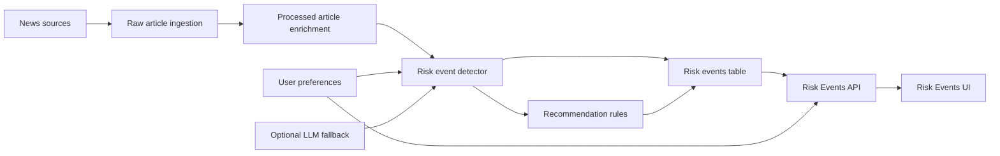

# Risk Event Layer Design

Date: 2026-07-12

## Objective

Add a first-class Risk Events layer to ProcureSignal so the product does more than show procurement news. The system should detect procurement-relevant risks from processed articles, connect them to suppliers, locations, categories, and user preferences, then present evidence-backed recommendations in a professional workflow.

This is the first step toward a credible agentic procurement intelligence platform. The system can observe, reason, score, explain, and recommend, but it must not take external actions without human approval.

## Product Scope

Phase 1 will add:

- A deterministic procurement risk taxonomy with flexible aliases.
- A backend risk detector that reads processed articles and creates risk events.
- Idempotent storage so rerunning jobs does not create duplicate events.
- A Risk Events API for list, filter, and status update workflows.
- A small professional Risk Events UI page.
- Tests for matching, ranking, idempotency, API behavior, and UI loading.

Phase 1 will not add:

- Autonomous email sending or supplier outreach.
- Full supplier knowledge graph modeling.
- Heavy LLM classification for every article.
- Contract, sourcing, or ERP integrations.
- Automated business decisions without review.

## Architecture

The feed remains the source of market intelligence articles. Risk Events becomes the procurement impact layer: it answers what matters, why it matters, how confident the system is, and what a buyer should review next.

## Data Model

Create a `RiskEvent` model with fields equivalent to:

- `id`
- `event_key`, a deterministic unique key for idempotency
- `processed_article_id`
- `risk_type`
- `severity`
- `confidence`
- `affected_suppliers`
- `affected_locations`
- `affected_categories`
- `evidence_snippet`
- `recommendation`
- `source_name`
- `source_url`
- `published_at`
- `status`
- `created_at`
- `updated_at`

Recommended statuses:

- `new`
- `reviewed`
- `dismissed`

Recommended severity levels:

- `low`
- `medium`
- `high`
- `critical`

The first version can store suppliers, locations, and categories as structured arrays using the existing database conventions. A later version can normalize these into a graph-style supplier-location-risk model.

## Risk Taxonomy

Use a fixed taxonomy with flexible aliases. This keeps the system explainable, testable, and cost-efficient while still allowing natural user input.

Initial risk types:

- `geopolitical`
- `regional_conflict`
- `supply_disruption`
- `tariff`
- `sanctions`
- `regulatory`
- `bankruptcy`
- `strike`
- `quality`
- `m_and_a`
- `currency`
- `logistics`
- `cybersecurity`
- `commodity`

Example aliases:

- `war`, `middle east`, `red sea`, `gulf`, `iran`, `israel`, `conflict` map to geopolitical or regional conflict risk.
- `supply chain`, `shortage`, `port delay`, `factory shutdown` map to supply disruption or logistics risk.
- `import duty`, `trade duty`, `customs duty` map to tariff risk.
- `export control`, `blacklist`, `embargo` map to sanctions risk.
- `recall`, `defect`, `quality issue` map to quality risk.

Aliases should be shared by preference matching and risk detection so user-entered preference terms behave consistently across the product.

## Detection Behavior

The detector should run after article processing and use deterministic signals first:

1. Combine article title, summary, body snippet, source, extracted suppliers, regions, categories, and existing signal tags.
2. Match text and metadata against the risk taxonomy and aliases.
3. Extract evidence snippets around the strongest matched terms.
4. Estimate severity from risk type, source terms, and impact terms.
5. Estimate confidence from strength of match, metadata availability, and number of independent cues.
6. Create or update a risk event using the deterministic event key.

Preference-aware ranking:

- If a user has supplier, location, category, or misc risk preferences, matching risk events should rank higher.
- If no preferences exist, show general procurement risks.
- If an article has no supplier or location, still create the risk event when evidence is strong.

OpenAI usage:

- Do not call OpenAI for every article in Phase 1.
- Keep deterministic detection as the default path.
- Later, use the cheapest suitable model only for low-confidence summaries, explanation improvement, or complex entity disambiguation.

## Idempotency

Jobs must be safe to rerun.

The `event_key` should be derived from stable inputs such as:

- processed article id
- risk type
- normalized supplier list
- normalized location list

If the same event is detected again, update confidence, severity, evidence, and timestamp instead of inserting a duplicate.

## API Design

Add endpoints equivalent to:

- `GET /api/risk-events`
- `GET /api/risk-events/{id}`
- `PATCH /api/risk-events/{id}/status`

Supported list filters:

- `risk_type`
- `severity`
- `status`
- `supplier`
- `location`
- `category`
- `limit`
- `offset`

The API should return enough data for the UI to show the risk, confidence percentage, evidence, source article, and recommendation without additional calls.

## UI Design

Add a `Risk Events` nav item.

The page should be compact and professional, closer to a procurement operations surface than a marketing dashboard. It should include:

- Risk type
- Severity
- Confidence as a percentage
- Affected supplier or location when available
- Source article and date
- Evidence snippet
- Recommended next step
- Status control for `new`, `reviewed`, and `dismissed`

Empty state:

- If no risks are found, explain that no procurement risks match the current profile yet and suggest broadening preferences or checking the general feed.

The UI must not disturb the existing Feed, Preferences, Chat, Currency, language, or login flows.

## Recommendations

Recommendations should be rule-based in Phase 1. Examples:

- High geopolitical risk with matching location: "Review supplier exposure in this region before placing large orders."
- Tariff risk: "Check landed cost and tariff exposure before confirming new purchase orders."
- Supply disruption risk: "Review alternate suppliers and inventory coverage."
- Currency risk: "Compare timing with the EUR monitor before committing spend."
- Sanctions risk: "Review compliance exposure before engaging affected suppliers."

## Error Handling

- If one article fails risk detection, log the failure and continue processing the rest.
- If taxonomy matching finds no events, do not create low-quality placeholder events.
- If source metadata is incomplete, create the event only when article evidence is strong enough.
- If the optional LLM fallback is disabled or unavailable, deterministic risk detection must still work.

## Testing

Backend tests:

- Taxonomy aliases map correctly, including terms like `war`, `middle east`, `supply chain`, `sanctions`, and `tariff`.
- The detector creates events from relevant processed articles.
- Reprocessing the same article does not create duplicates.
- Preference terms rank matching events higher.
- No-preference users still receive general procurement risks.
- API filters work for risk type, severity, status, supplier, location, and category.

Frontend tests:

- Risk Events page loads.
- Empty state renders.
- Risk rows show confidence as only a number with `%`.
- Status changes call the API.
- Existing primary pages still load.

## Rollout Plan

1. Add taxonomy and detector tests first.
2. Add database model and migration.
3. Implement detector service and idempotent upsert behavior.
4. Add API schemas and routes.
5. Connect detector to the processing job.
6. Add the Risk Events UI.
7. Run backend and frontend verification.
8. Keep the work on a separate branch until the user confirms the app still works.

## Success Criteria

The feature is successful when:

- Processed articles generate procurement risk events.
- User-entered misc terms like `war`, `middle east`, and `supply chain` influence risk ranking.
- Duplicate events are not created by reruns.
- Risk confidence displays as a clean percentage.
- The UI feels professional and does not break the existing working app.
- The architecture is explainable in interviews as a deterministic-first, agentic procurement intelligence layer.
